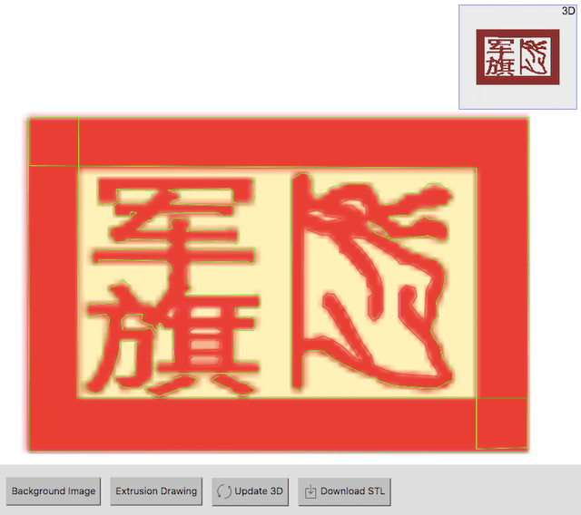

# ezphototrace

**Trace photos, export STLs.**

Useful for adding extruded features to 3D prints. Written originally as part of "bikestats", a custom bike geometry-based builder that could trace frames.

## Features

- Use binary tracing operations to create complex shapes
- Mouse wheel + drag to reposition background image within viewport
- Export STLs

### todo

- define the height of extrusions
- resize the tracings based on a known measurement

## Getting started

You can run it locally with `yarn`:

```
yarn
yarn start
```

OR simply open index.html in your browser.

## Typical workflow

1. Vectorize a photo by tracing it within ezphototrace
    

2. Export to STL
    

3. Run [netfabb](https://service.netfabb.com) to fix any STL errors

4. Import into OpenSCAD for post-processing and export as a printable STL

5. Load into [Cura](https://ultimaker.com/en/products/cura-software) and slice it into gcode
    

### MIT Licensed
